# CoinPulse — Crypto Trading Simulator

CoinPulse is a cryptocurrency trading simulator. You start with **$1,000,000** of
simulated USD and trade real coins at live prices — placing market, limit, and
stop orders, tracking your portfolio over time, and following other traders in a
social feed.

🔗 **Live demo:** [coin-pulse-ffda7bc3f791.herokuapp.com](https://coin-pulse-ffda7bc3f791.herokuapp.com/)

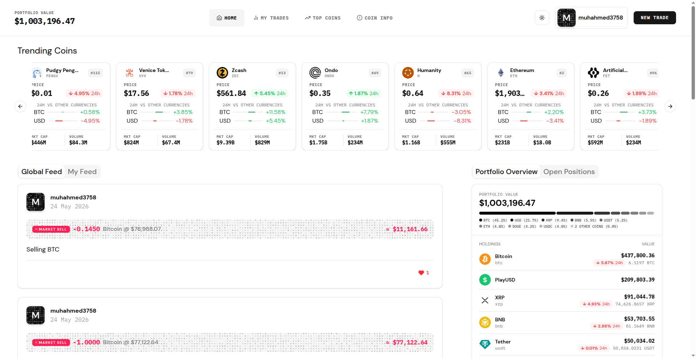

> **v2 rewrite:** CoinPulse began as a server-side-rendered Flask app (vanilla
> JavaScript + Jinja2 templates). It is now a **React single-page application**
> (React 19 + TypeScript + Tailwind CSS v4) talking to the Flask backend as a
> JSON API. See [Version history](#version-history) for the original version.

## Contents

- [Features](#features)
- [Tech Stack](#tech-stack)
- [Getting Started](#getting-started)
- [Environment variables](#environment-variables)
- [Screenshots](#screenshots)
- [Version history](#version-history)

## Features

- **Trading simulator** — Place market, limit, and stop **buy/sell** orders at
  real-time prices from the CoinGecko API. Limit and stop orders are executed
  automatically by a background worker when market conditions match (and
  cancelled if you no longer have the funds).
- **Portfolio tracking** — Watch your USD balance, crypto holdings, and total
  portfolio value evolve over time with interactive charts.
- **Trade history** — Browse executed and open orders in sortable data grids,
  and cancel open orders at any time.
- **Social feed** — Share trades to a global timeline, browse other users'
  trades, and like them.
- **Coin info & market data** — Detailed per-coin pages with OHLC, price,
  volume, and market-cap charts, plus market stats (supply, ATH/ATL, etc.).
- **Real-time news** — Recent crypto news for any coin via the NewsData.io API.
- **Reddit integration** — Recent Reddit discussion for any coin via the Reddit API.
- **Authentication** — Email/password or OAuth (Discord / Google), with email
  verification and password reset via secure tokenized links.
- **Theming** — Light, dark, and system themes.

## Tech Stack

**Frontend**

- React 19 + TypeScript, built with [Vite](https://vite.dev/)
- Tailwind CSS v4 with [shadcn/ui](https://ui.shadcn.com/) + Radix UI components
  and custom `animate-ui` / Motion animations
- [TanStack React Query](https://tanstack.com/query) for server state
- React Router v7 for client-side routing
- [AG Grid](https://www.ag-grid.com/) for data tables and [Highcharts](https://www.highcharts.com/) for charts

**Backend**

- Flask (app factory + blueprints), Flask-SQLAlchemy, Flask-Migrate (Alembic)
- Flask-JWT-Extended — JWT access/refresh tokens in httpOnly cookies with CSRF protection
- Flask-Login, Flask-Mail, Flask-Cors
- A supervised background worker (threads with auto-restart) that executes open
  limit/stop orders and revalues wallets
- Gunicorn as the production WSGI server

**Database**

- PostgreSQL (UUID primary keys, JSONB asset holdings)

**External data**

- [CoinGecko API](https://www.coingecko.com/en/api) — live prices, market data, OHLC
- [NewsData.io API](https://newsdata.io/) — per-coin crypto news
- [Reddit API](https://www.reddit.com/dev/api/) — coin discussions

## Getting Started

### Prerequisites

- Python 3.12
- Node.js 22
- PostgreSQL

### 1. Backend setup

```bash
git clone git@github.com:muhammadAhmed2315/CoinPulse-CryptoTradingSimulator.git
cd CoinPulse-CryptoTradingSimulator

python -m venv venv
source venv/bin/activate          # Windows: venv\Scripts\activate
pip install -r requirements.txt
```

Create a `.env` file in the project root and fill in the required variables (see
[Environment variables](#environment-variables)). Then create and migrate the
database:

```bash
python dbCreator.py               # first run only — creates the PostgreSQL database
flask db upgrade                  # apply migrations
```

### 2. Frontend setup

```bash
cd frontend
npm install
cp .env.example .env              # optional — defaults to http://localhost:5000
```

### 3. Run in development

Run the backend and frontend in two terminals.

**Backend** (with the background order-execution threads):

```bash
python app.py                     # http://localhost:5000
```

> Use `flask run` instead if you want the API without the background threads.

**Frontend** (Vite dev server):

```bash
cd frontend
npm run dev                       # http://localhost:5173
```

Then open **http://localhost:5173**.

### 4. Production build (single app)

Build the SPA, then let Flask serve it:

```bash
cd frontend && npm run build      # outputs frontend/dist
cd ..
gunicorn app:app                  # serves the API + the built SPA
python worker.py                  # background tasks (separate process)
```

This mirrors the `Procfile` (`web: gunicorn app:app`, `worker: python worker.py`).

## Environment variables

Set these in the root `.env`:

| Variable | Purpose |
| --- | --- |
| `DATABASE_URL`, `POSTGRESQL_USERNAME`, `POSTGRESQL_PASSWORD` | PostgreSQL connection |
| `FLASK_APP_SECRET_KEY` | Flask session secret |
| `JWT_SECRET_KEY` | JWT signing (sessions + email-verification / password-reset tokens) |
| `COINGECKO_API_KEY` | Live price / market data |
| `NEWSDATA_API_KEY` | Crypto news (NewsData.io) |
| `MAIL_USERNAME`, `MAIL_PASSWORD` | Sending verification / reset emails |
| `DISCORD_OAUTH2_CLIENT_ID`, `DISCORD_OAUTH2_CLIENT_SECRET` | Discord OAuth |
| `GOOGLE_CLIENT_ID`, `GOOGLE_CLIENT_SECRET` | Google OAuth |
| `REDDIT_CLIENT_ID`, `REDDIT_SECRET_KEY`, `REDDIT_USERNAME`, `REDDIT_PASSWORD`, `REDDIT_USER_AGENT` | Reddit API |
| `FLASK_ENV` | Set to `production` in deployment (enables secure cookies) |

### URL configuration (deployment)

By default the app is wired for local development, but the URLs that couple the
frontend and backend are configurable. All are optional and fall back to their
localhost defaults when unset.

**Frontend** (set in `frontend/.env`; see `frontend/.env.example`):

- `VITE_API_BASE_URL` — base URL of the Flask backend. Defaults to
  `http://localhost:5000`.

**Backend** (set in the root `.env`):

- `FRONTEND_URL` — base URL the backend redirects to after OAuth sign-in. Defaults
  to `http://localhost:5173`.
- `DISCORD_OAUTH2_REDIRECT_URI` — Discord OAuth callback URL. Defaults to
  `http://localhost:5000/callback_discord`.
- `GOOGLE_REDIRECT_URI` — Google OAuth callback URL. Defaults to
  `http://localhost:5000/callback_google`.
- `CORS_ORIGINS` — comma-separated list of allowed frontend origins. Defaults to
  `http://localhost:5173,http://127.0.0.1:5173`.

## Screenshots

### v2 — current (React + Tailwind)

**Dashboard** — trending coins, global/personal feed, and portfolio overview


**New trade** — market / limit / stop buy & sell
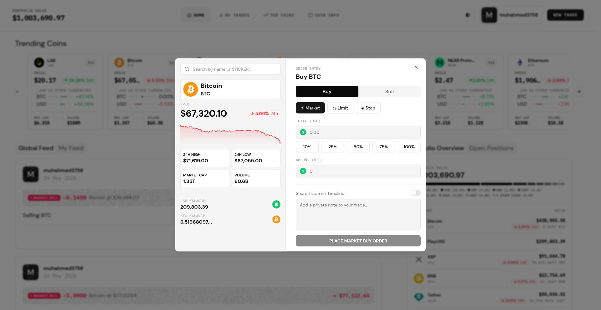

**Coin info** — OHLC / price / volume / market-cap charts, news, and Reddit
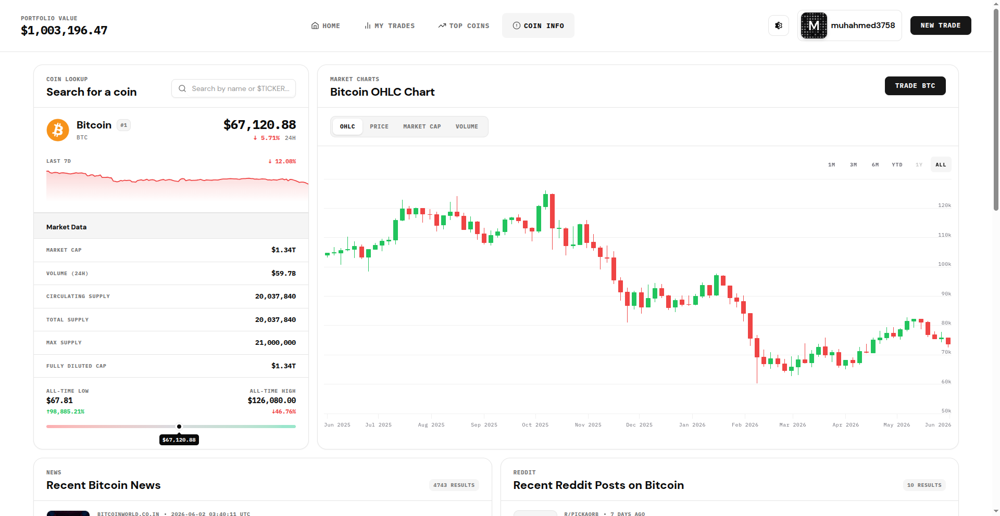
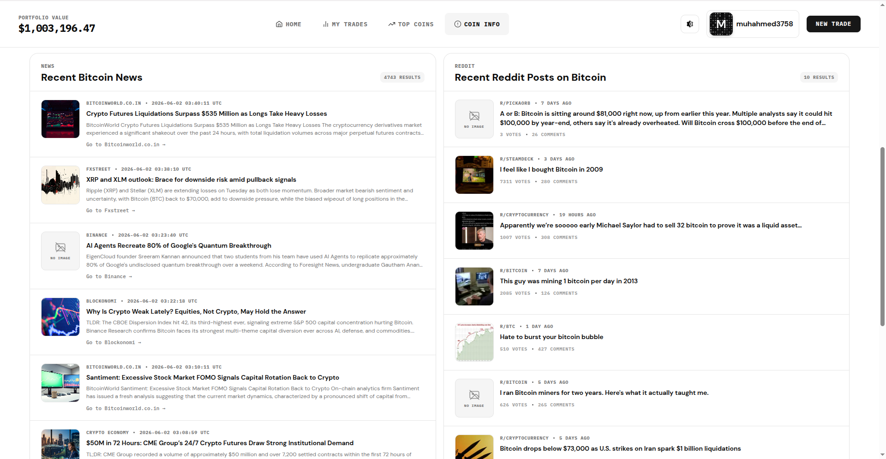

**My trades** — executed and open orders
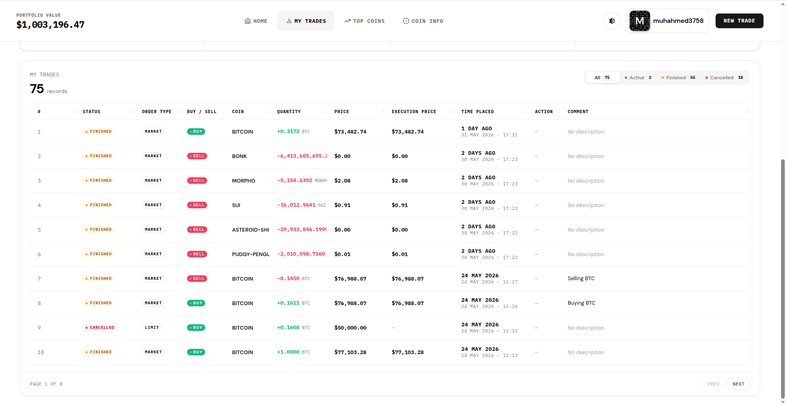

**Top coins**
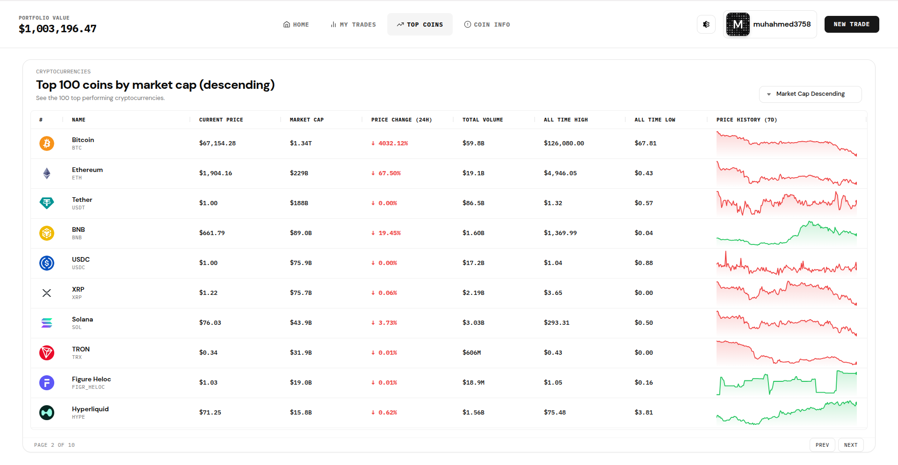

**Portfolio analytics**
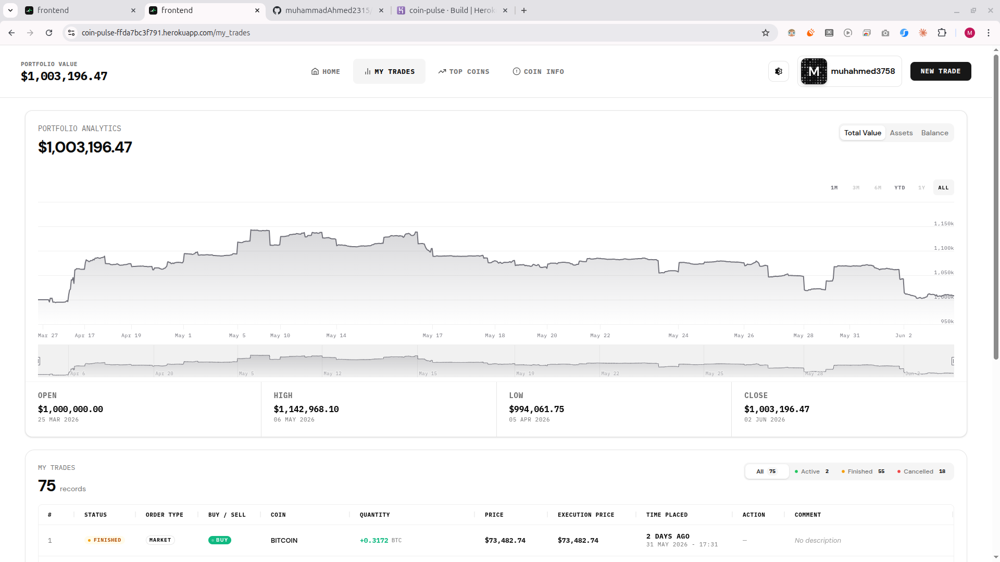

**Login**
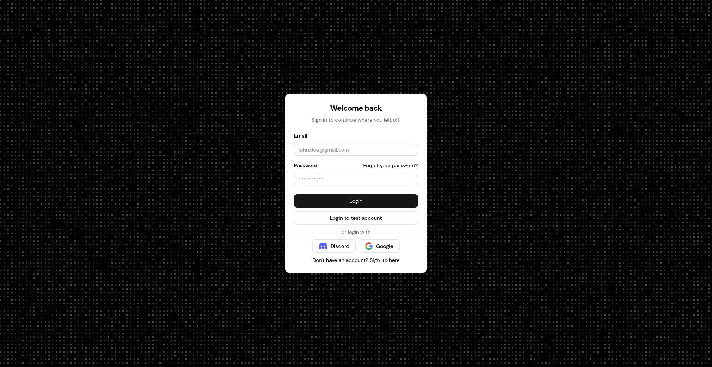

## Version history

CoinPulse was originally a **server-side-rendered** Flask application: vanilla
JavaScript (no frontend framework) rendered into Jinja2 templates, with a
companion REST API built from Flask blueprints. It has since been rewritten into
the React SPA described above, with the Flask side now serving a JSON API (plus
static hosting of the built bundle).

The final commit of the original SSR version is
[`ee6ed05`](https://github.com/muhammadAhmed2315/CoinPulse-CryptoTradingSimulator/commit/ee6ed0576f970bc816a0d2e44868ed181b0fccac).

### v1 — original (vanilla JS + Jinja templates)

**Dashboard**
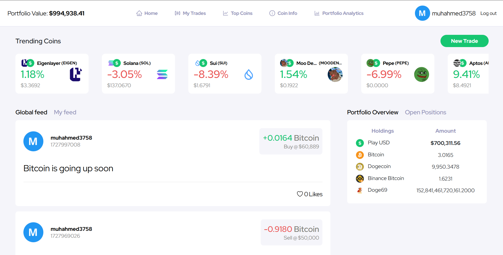

**New trade**
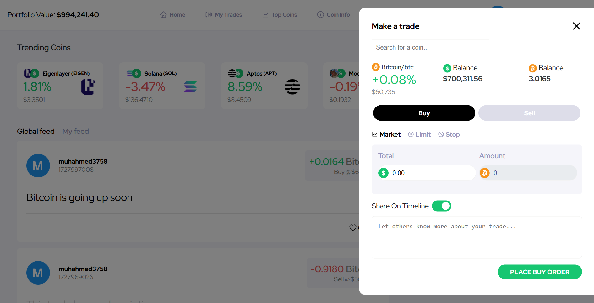

**Portfolio analytics**
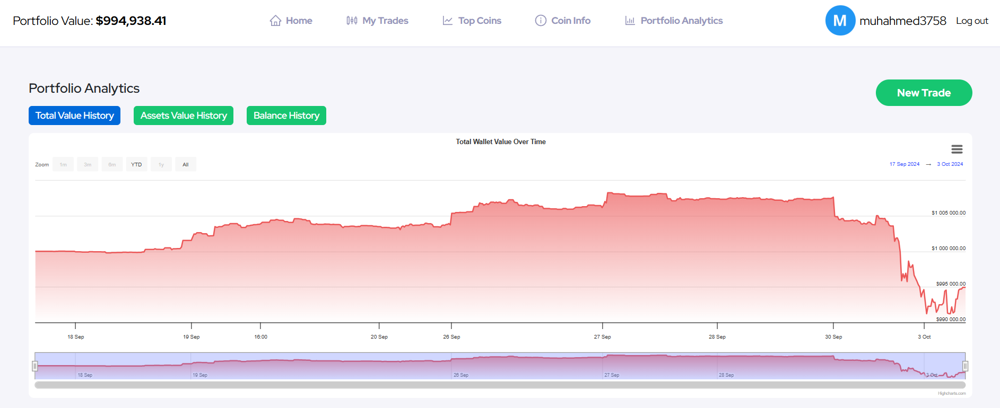

**My trades**
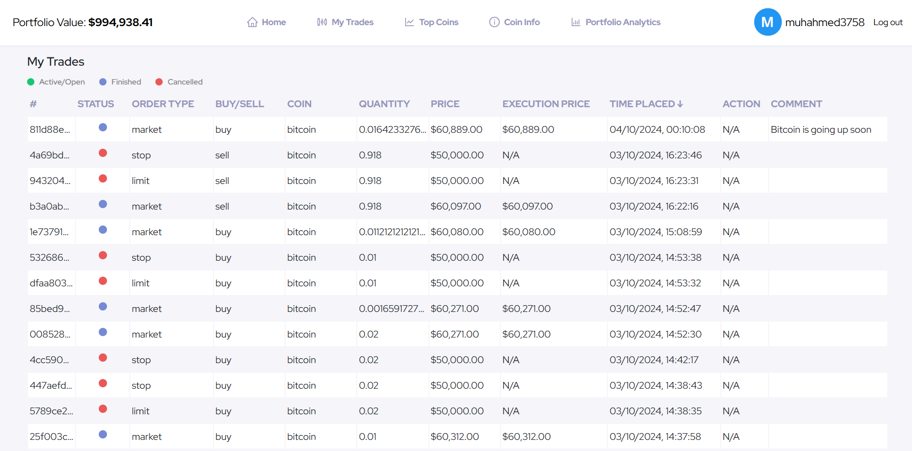

**Coin info**
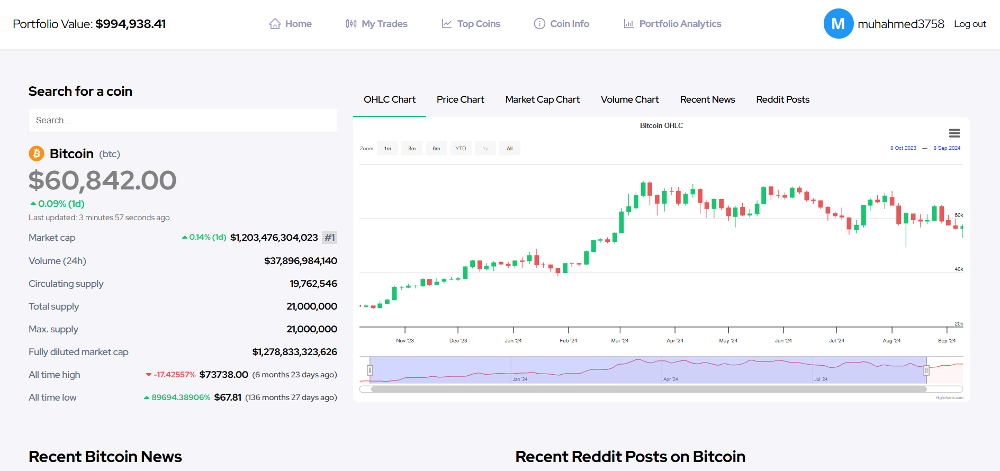
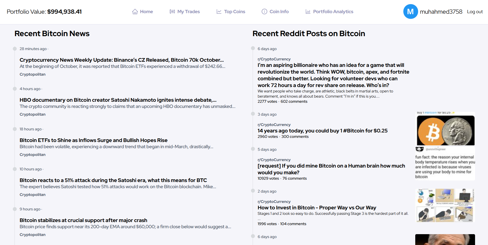

**Top coins**
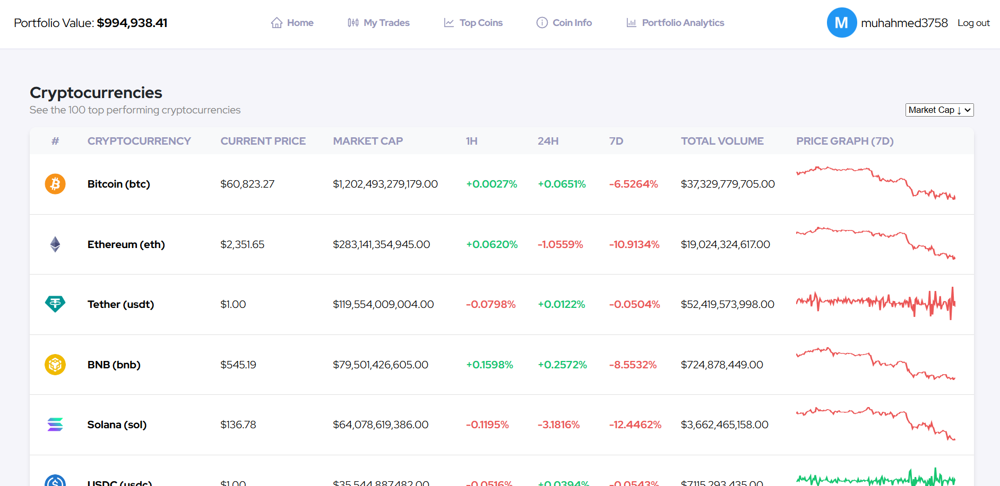

**Login**
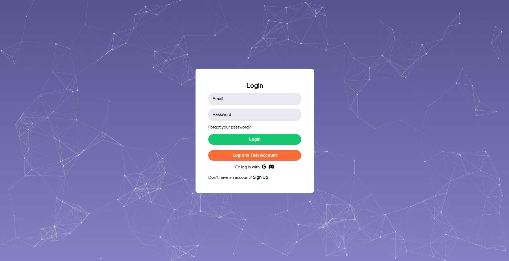

**Sign up**
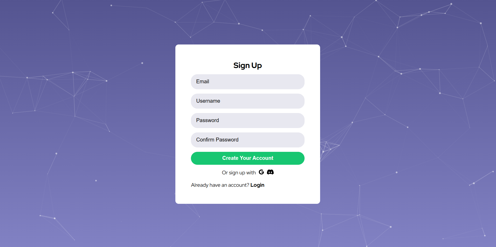
