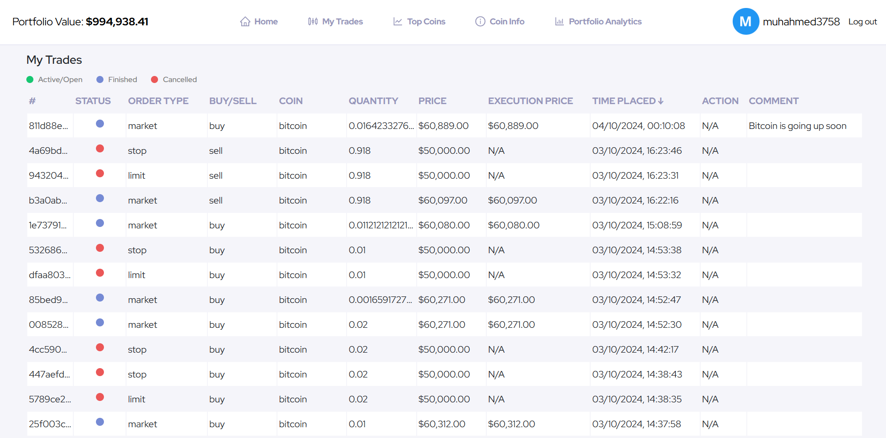

# Flask Crypto Trading Simulator Website

## Project Description

A Flask-based web application that allows users to simulate cryptocurrency trading in a realistic environment. Users can place different types of trades, view historical trade data, monitor their portfolio over time, and interact with other users by liking their trades. The website also offers a RESTful API to allow programmatic interaction.

## Deployed Site

The website is deployed on [CoinPulse](https://coin-pulse-ffda7bc3f791.herokuapp.com/dashboard).
NOTE: If you don't wish to create an account, you can use the following login and password:
- muhahmed3758@gmail.com
- Password123/

## Features

- **User Authentication:** Register via email or OAuth (Discord/Google), email verification, and password reset options.
- **Password Reset:** Users can securely reset passwords through token-generated email links
- **Trading Simulator:** Place market buy/sell, limit buy/sell, and stop buy/sell orders based on real-time data from the CoinGecko API. Limit and stop orders are automatically executed in the background using multithreading when market prices match them.
- **Trade History:** View detailed history of trades, including executed and open trades.
- **Portfolio Tracking:** Monitor the value of your USD balance, cryptocurrency assets, and total portfolio over time with interactive graphs.
- **Social Interaction:** Users can see, comment, and like other users' trades.
- **Charts and Market Data:** Users can access detailed charts for any cryptocurrency, including historical data such as OHLC (Open, High, Low, Close), price, volume, and market cap.
- **Real-Time News:** Users can access real-time news about any given coin, thanks to web scraping Yahoo News.
- **Reddit Integration:** Users can access recent Reddit posts about a specific coin using the Reddit API.
- **RESTful API:** Programmatic access to user actions (such as placing orders), market data, news articles, and Reddit posts.

## Setup Instructions

1. **Clone the Repository:**
   ```
   git clone <repository-url>
   ```
2. **Create a Virtual Environment:**
   ```
   python -m venv venv
   ```
3. **Activate the Virtual Environment:**
   - Windows:
     ```
     venv\Scripts\activate
     ```
   - Mac/Linux:
     ```
     source venv/bin/activate
     ```
4. **Install Requirements:**
   ```
   pip install -r requirements.txt
   ```
5. **Set Environment Variables:** Create a `.env` file and provide values for the required variables such as `COINGECKO_API_KEY`, `DATABASE_URL`, `REDDIT_CLIENT_ID`, etc.
6. **Initialize the Database:**
   ```
   flask db upgrade
   ```
7. **Run the Application Locally:**
   ```
   flask run
   ```
8. **Access the Website:** Go to `http://127.0.0.1:5000` in your browser.

## Technologies Used

- **Backend:** Flask, Flask-SQLAlchemy, Flask-RESTful, Flask-Session, Flask-Login
- **Database:** PostgreSQL (via Heroku Postgres add-on)
- **Front-end:** HTML, CSS, JavaScript
- **APIs:** CoinGecko API for live cryptocurrency data, Reddit API for Reddit posts about a specific coin
- **Authentication:** OAuth (Discord, Google), JWT for API access

## Screenshots

- **Homepage**
  
- **Trading Dashboard**
  
- **Portfolio Analytics**
  
- **Transactions Page**
  
- **Coin Info Page**
  
  
- **Top Coins Page**
  
- **Login Page**
  
- **Sign Up Page**
  
